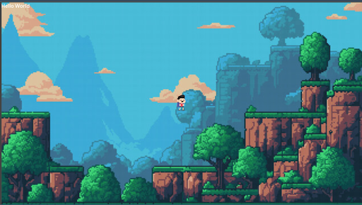
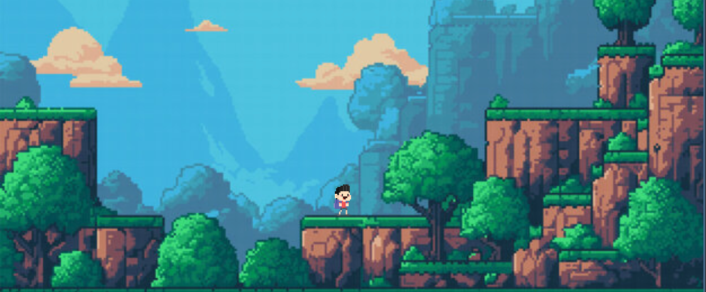
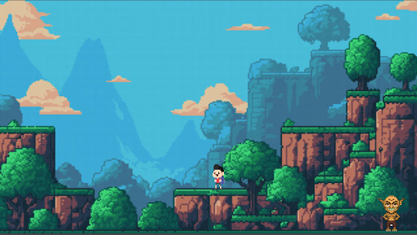
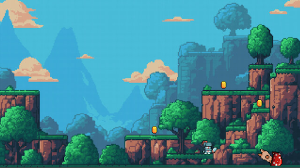
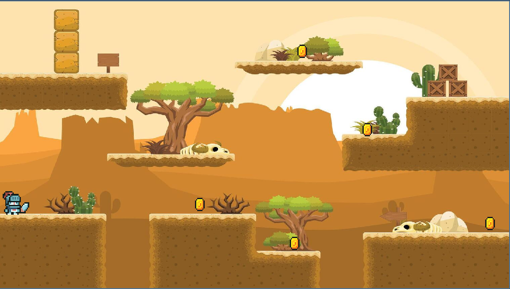

# Simple Scene with a Moving Node

**Date:** January 31  
**Week:** 1  

## Activity Overview
For this activity, I created a simple Godot project that demonstrates a moving node and displays a "Hello World" message. This exercise introduces basic scene setup, node hierarchy, and simple scripting in Godot.

---

## Steps Taken

1. **Created a new Godot Project**
   - Project Type: 2D
   - Created a main scene with a `Node2D` as root.
   - Added a `Label` node to display "Hello World".

2. **Added a Moving Node**
   - Created a `Sprite2D` node to act as a simple moving object.
   - Attached a script to move the node horizontally across the screen.

3. **Captured Screenshots**
   - Took screenshots showing the project running and the node moving.

4. **Uploaded to GitHub**
   - Pushed the project to the repository.
   - Updated this README with activity details and screenshots.

---

## Screenshots

---

## Notes
- This activity demonstrates creating a scene, adding nodes, and attaching simple scripts in Godot.
- It is a foundational step for understanding how nodes interact in Godot projects.

# Player Movement with Dash
**Date:** February 20  
**Week:** 2

## Activity Overview
For this activity, I created a Godot project that demonstrates **2D player movement** using keyboard input, physics, jumping, and a dash (dodge) mechanic. This exercise introduces player control, gravity, and basic game mechanics in Godot.

---

## Steps Taken
1. **Created a new Godot Project**  
   - Project Type: 2D  

2. **Created a main scene**  
   - Root node: `CharacterBody2D`  
   - Added a `Sprite2D` node for the player character.  

3. **Added player movement**  
   - Scripted left and right movement using keyboard input (`move_left` and `move_right`).  
   - Implemented jumping with physics using gravity and jump impulse.  

4. **Implemented dash mechanic**  
   - Added a dodge action with speed, duration, and cooldown.  
   - Dash moves the player in the current facing direction.  

5. **Made the player face left or right**  
   - Flipped the sprite horizontally depending on movement direction.  

6. **Captured Screenshots**  
   - Took screenshots showing the player moving, jumping, and dashing.  

7. **Uploaded to GitHub**  
   - Pushed the project to the repository.  
   - Updated this README with activity details and screenshots.  

---

## Screenshots

---

## Notes
This activity demonstrates handling **keyboard input**, **physics-based movement**, and a **dash mechanic** in a 2D Godot game. It builds on foundational skills from Week 1 and prepares for more advanced player interactions.

# Level 2, Portals, and Basic Combat

**Date: February (Week 3)**

## Activity Overview

# For this week’s activity, I expanded the Godot project by introducing:

Features Implemented
**1. Portals and Level Transition**

- Created a Portal scene that triggers when the player enters it.
- The portal only becomes active after meeting level conditions (e.g., collecting objectives).
- Used scene switching to load Level 2 when the portal is activated.

**2. Level 2 Setup**

- Designed a new scene for Level 2 with different obstacles and layout.
- Implemented a separate set of nodes for Level 2 to keep levels modular.
- Scene is loaded dynamically via code when the portal is used.

**3. Combat Mechanics**

- Added an Enemy node that periodically shoots projectiles.
- Projectiles can damage the player if not dodged.
- Player must avoid projectiles or use movement and dash mechanics to survive.

**4. Enemy Projectile System**

- Projectiles are spawned at intervals.
- They move in a straight direction toward the player’s area.
- Collision detection is used to register hits.

**5. Node and Scene Structure**

- Portal as its own scene (portal.tscn).
- Enemy as its own scene (enemy.tscn).
- Level 2 as a separate scene.

---

## Screenshots

---

## Notes
Scene transitions help in organizing game progression.
Combat mechanics introduce interaction and challenge.
Future improvements may include health systems and additional enemy types.