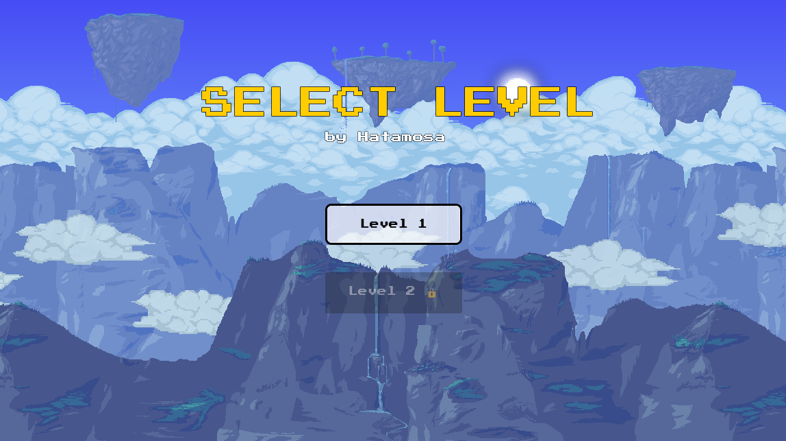
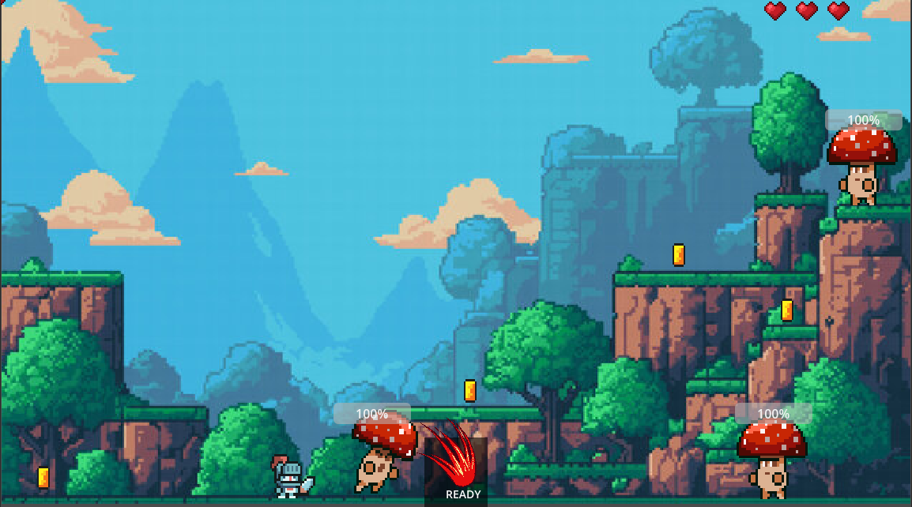
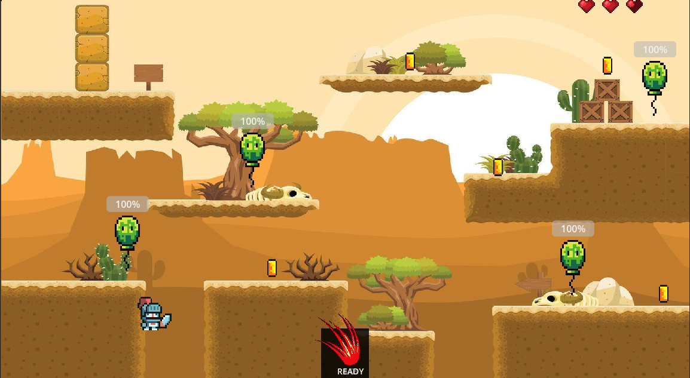

# Simple Scene with a Moving Node

**Date:** January 31  
**Week:** 1  

## Activity Overview
For this activity, I created a simple Godot project that demonstrates a moving node and displays a "Hello World" message. This exercise introduces basic scene setup, node hierarchy, and simple scripting in Godot.

---

## Steps Taken

1. **Created a new Godot Project**
   - Project Type: 2D
   - Created a main scene with a `Node2D` as root.
   - Added a `Label` node to display "Hello World".

2. **Added a Moving Node**
   - Created a `Sprite2D` node to act as a simple moving object.
   - Attached a script to move the node horizontally across the screen.

3. **Captured Screenshots**
   - Took screenshots showing the project running and the node moving.

4. **Uploaded to GitHub**
   - Pushed the project to the repository.
   - Updated this README with activity details and screenshots.

---

## Screenshots

---

## Notes
- This activity demonstrates creating a scene, adding nodes, and attaching simple scripts in Godot.
- It is a foundational step for understanding how nodes interact in Godot projects.

# Player Movement with Dash
**Date:** February 20  
**Week:** 2

## Activity Overview
For this activity, I created a Godot project that demonstrates **2D player movement** using keyboard input, physics, jumping, and a dash (dodge) mechanic. This exercise introduces player control, gravity, and basic game mechanics in Godot.

---

## Steps Taken
1. **Created a new Godot Project**  
   - Project Type: 2D  

2. **Created a main scene**  
   - Root node: `CharacterBody2D`  
   - Added a `Sprite2D` node for the player character.  

3. **Added player movement**  
   - Scripted left and right movement using keyboard input (`move_left` and `move_right`).  
   - Implemented jumping with physics using gravity and jump impulse.  

4. **Implemented dash mechanic**  
   - Added a dodge action with speed, duration, and cooldown.  
   - Dash moves the player in the current facing direction.  

5. **Made the player face left or right**  
   - Flipped the sprite horizontally depending on movement direction.  

6. **Captured Screenshots**  
   - Took screenshots showing the player moving, jumping, and dashing.  

7. **Uploaded to GitHub**  
   - Pushed the project to the repository.  
   - Updated this README with activity details and screenshots.  

---

## Screenshots

---

## Notes
This activity demonstrates handling **keyboard input**, **physics-based movement**, and a **dash mechanic** in a 2D Godot game. It builds on foundational skills from Week 1 and prepares for more advanced player interactions.

# Level 2, Portals, and Basic Combat

**Date: February (Week 3)**

## Activity Overview

# For this week’s activity, I expanded the Godot project by introducing:

Features Implemented
**1. Portals and Level Transition**

- Created a Portal scene that triggers when the player enters it.
- The portal only becomes active after meeting level conditions (e.g., collecting objectives).
- Used scene switching to load Level 2 when the portal is activated.

**2. Level 2 Setup**

- Designed a new scene for Level 2 with different obstacles and layout.
- Implemented a separate set of nodes for Level 2 to keep levels modular.
- Scene is loaded dynamically via code when the portal is used.

**3. Combat Mechanics**

- Added an Enemy node that periodically shoots projectiles.
- Projectiles can damage the player if not dodged.
- Player must avoid projectiles or use movement and dash mechanics to survive.

**4. Enemy Projectile System**

- Projectiles are spawned at intervals.
- They move in a straight direction toward the player’s area.
- Collision detection is used to register hits.

**5. Node and Scene Structure**

- Portal as its own scene (portal.tscn).
- Enemy as its own scene (enemy.tscn).
- Level 2 as a separate scene.

---

## Screenshots

---

## Notes
Scene transitions help in organizing game progression.
Combat mechanics introduce interaction and challenge.
Future improvements may include health systems and additional enemy types.

# UI/UX, HUD, Audio & Enemy AI

**Date: February 28 (Week 3 - Activity 1 & 2)**

## Activity Overview

This week focused on building out the full UI/UX system, integrating audio, and implementing enemy AI behaviors into the game prototype.

---

## Features Implemented

**1. HUD System**
- Implemented a heart-based health system with 3 hearts, each divided into 4 quarters (12 total HP).
- Used a 32x32 pixel heart spritesheet with 5 frames representing full to empty states.
- Hearts update in real time as the player takes damage.
- Player HP carries over between levels — health is not reset on level transition.

**2. Menu System**
- Built a main menu with a scrolling parallax background.
- Added level select buttons with styled UI using a custom 8-bit font (Press Start 2P).
- Level 2 is locked until the player clears Level 1 via the portal.
- Author name displayed on the menu screen.

**3. Pause Menu**
- Implemented a pause menu triggered by the ESC key.
- Options to resume the game or return to the main menu.

**4. Death System**
- Player has a death animation that plays on reaching 0 HP.
- Death menu appears after the animation with options to respawn or return to the main menu.
- Respawning reloads the current level with full HP restored.

**5. Special Attack**
- Added a right-click special attack with a 10-second cooldown.
- Deals random damage between 1.5x–3x normal attack damage.
- Cooldown icon displayed on the HUD with a timer countdown.
- Separate hitbox for the special attack with a different collision shape.

**6. Damage Numbers & Enemy HP Bars**
- Floating damage numbers appear above enemies when hit.
- Special attacks show larger, orange damage numbers.
- Each enemy has a ProgressBar HP bar displayed above them.

**7. Level Notifications**
- A level name notification fades in and out when entering a new level.
- Level 2 displays an additional message: "You have temporarily unlocked double jump for this level!"

**8. Double Jump (Level 2 Only)**
- Double jump is unlocked exclusively in Level 2.
- Triggered via the Global autoload when the player transitions through the portal.

**9. Audio**
- Background music added to the main menu, Level 1, and Level 2.
- Sound effects integrated for: jump, attack, special attack, dash, and player hurt.
- Balloon enemy plays an explosion sound on death.

**10. Enemy AI**
- Level 1 mushroom enemies detect the player within range and play an attack animation.
- Enemies deal continuous damage to the player on contact with a cooldown between hits.
- Level 2 balloon enemy has an explosion on death that deals area damage to nearby players.
- Enemies display HP bars and floating damage numbers when hit.

---

## Screenshots

---

## Notes
- The Global autoload script manages persistent state across scenes including current level, unlocked levels, and player HP.
- Audio uses Godot's built-in AudioStreamPlayer nodes attached directly to scenes.
- Future improvements may include more enemy types, ranged attacks, and a scoring system.